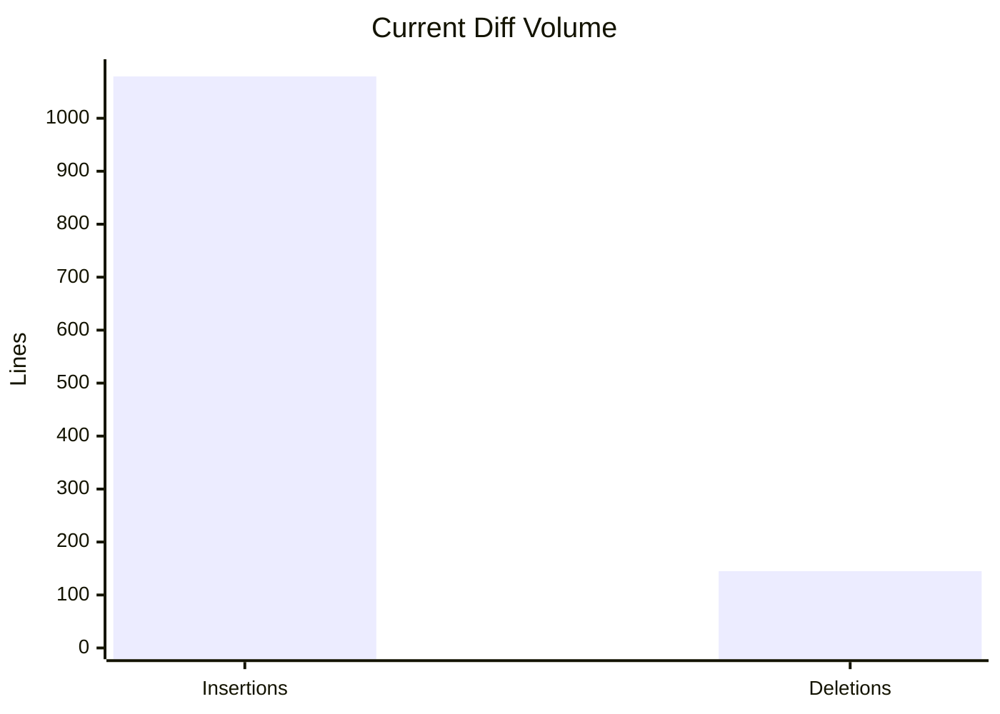
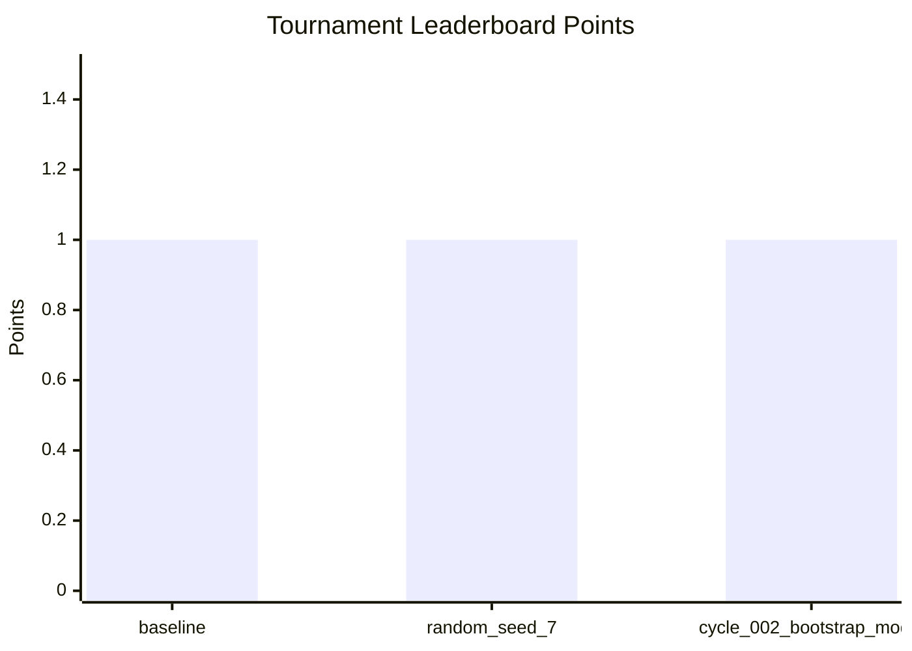
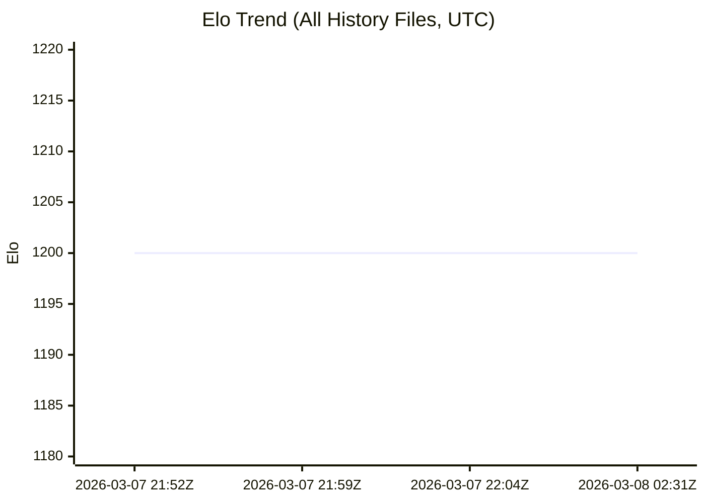
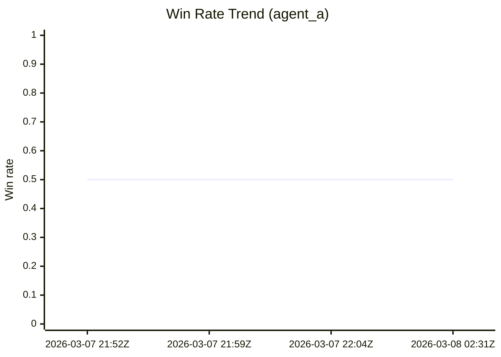

# Executive Review

- Generated (UTC): 2026-03-08T04:01:01Z
- Goal: strongest practical Hex6 engine for https://www.youtube.com/watch?v=Ob6QINTMIOA&t=595s

## Snapshot

| Metric | Value |
|---|---|
| Active run id | 20260307-205025 |
| Run state | running |
| Run started (UTC) | 2026-03-08T02:50:25.8224196Z |
| Planned run duration | 60 minutes |
| Search latency before (ms/call) | n/a |
| Search latency after (ms/call) | n/a |
| Observed speedup | n/a |
| Targeted validation tests | 21 passed |
| Working-tree changed files (current) | 27 |
| Diff shortstat |  27 files changed, 1079 insertions(+), 145 deletions(-) |
| Elo source files | 5 |
| Elo samples available | 4 |
| Latest Elo | 1200 |
| Latest win rate | 0.5 |
| Earliest Elo timestamp (UTC) | 2026-03-07T21:52:24Z |
| Latest Elo timestamp (UTC) | 2026-03-08T02:31:06Z |
| Tournament participants | 3 |
| Tournament leader | baseline |
| Tournament leader points | 1 |
| Tournament timestamp (UTC) | 2026-03-08T03:20:43Z |

## Graphs

## Elo Trend Data

- Source files scanned: 5
- `C:\Hexagonal tic tac toe\artifacts\arena_diagnose_fast_long\elo_history.json`
- `C:\Hexagonal tic tac toe\artifacts\bootstrap_fast_eval\elo_history.json`
- `C:\Hexagonal tic tac toe\artifacts\cycle_smoke\cycle_001\elo_history.json`
- `C:\Hexagonal tic tac toe\artifacts\cycle_smoke\cycle_002\elo_history.json`
- `C:\Hexagonal tic tac toe\artifacts\cycle_smoke\elo_history.json`

| Timestamp (UTC) | Elo | Win Rate | Games | Agent A |
|---|---:|---:|---:|---|
| 2026-03-07T21:52:24Z | 1200 | 0.5 | 2 | bootstrap_model |
| 2026-03-07T21:59:51Z | 1200 | 0.5 | 2 | bootstrap_model |
| 2026-03-07T22:04:18Z | 1200 | 0.5 | 2 | bootstrap_model |
| 2026-03-08T02:31:06Z | 1200 | 0.5 | 8 | bootstrap_model |

## Tournament Snapshot

- Summary: `C:\Hexagonal tic tac toe\artifacts\tournament\latest\summary.json`
| Rank | Agent | Kind | Points | Win Rate | W-L-D |
|---:|---|---|---:|---:|---|
| 1 | baseline | heuristic | 1 | 0.5 | 0-0-2 |
| 2 | random_seed_7 | random | 1 | 0.5 | 0-0-2 |
| 3 | cycle_002_bootstrap_model | model_guided | 1 | 0.5 | 0-0-2 |

## Strongest Strengths

- Focused engine/search regression tests passed (21 total in the targeted validation slice).
- Multi-agent YOLO orchestration is running continuously with automated status/output capture.
- Competitive benchmarking now includes random-opponent and multi-checkpoint tournament results.

## Best Opportunities

- Add/enable configurable transposition-table reuse and add it to `choose_turn`/`worst_reply_score` in a config-gated, bounded way (currently `use_transposition_table` is mostly unused).
- Add a dedicated regression test for `apply_cells` terminal-short-circuit semantics directly (not just via search path).
- Add an evaluator-style benchmark command in CI loop with fixed seeds and capped plies to track node/time + Elo trend per commit.

## Operational Notes

- Full `run_search_matrix` throughput is still the bottleneck in fast feedback loops.
- Prioritize improvements that reduce full-eval runtime while preserving tactical strength.
- Elo history is tracked and timestamped; review file source shown above.
- Tournament leaderboard is refreshed from `artifacts/tournament/latest/summary.json`.
