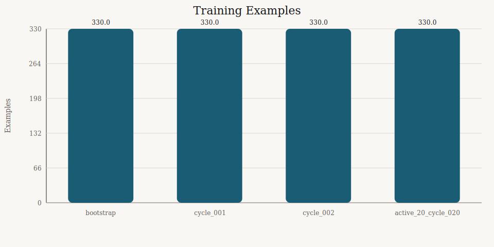
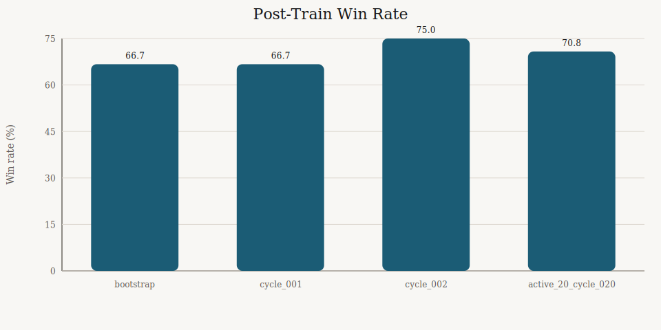
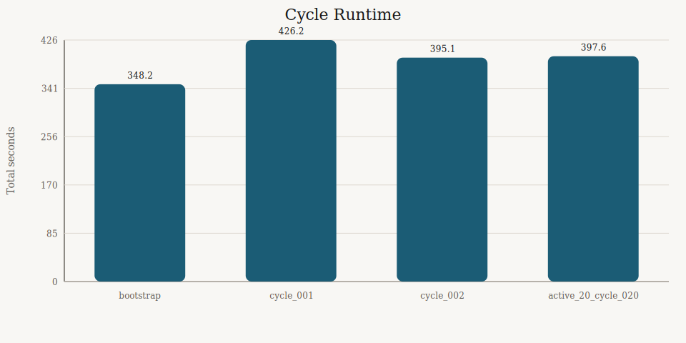
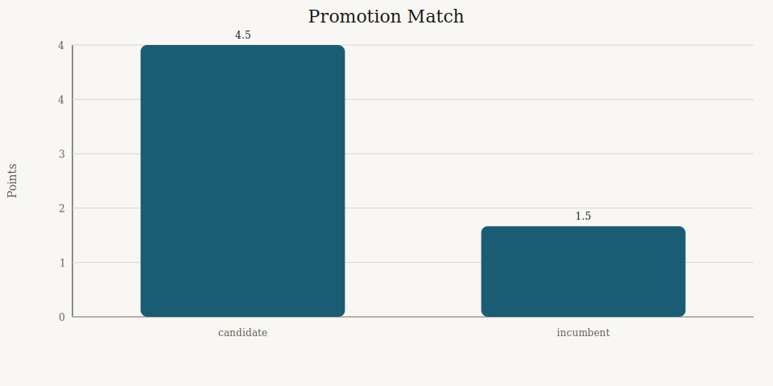

# Executive Review

- Generated (UTC): 2026-03-09T20:42:01Z
- Active lane: `15 x 15` bounded board, `guided_mcts`, AlphaZero-style self-play
- Main comparison lane: `configs/fast.toml` plus `configs/experiments/conversion_opening_suite.toml`

## TL;DR

- The repo is now centered on one active engine path instead of several stale comparison lanes.
- We have a validated improvement signal: `artifacts/alphazero_cycle_fast/cycle_002/promotion_match/summary.json` shows cycle 2 beating cycle 1 by `4.5 - 1.5`.
- The `20`-cycle run completed successfully and finished with cycle `020` as the best checkpoint under `artifacts/alphazero_cycle_20_fast/cycle_summary.json`.
- The default bounded lane ends on `win` or `board_exhausted`, not on an artificial ply cap.

## Current Snapshot

| Run | Examples | Encoded | Self-play s | Total s | Gate result |
|---|---:|---:|---:|---:|---|
| bootstrap | 330 | 308 | 341.94 | 348.23 | 3W 1L 2D vs baseline |
| cycle_001 | 330 | 308 | 415.92 | 426.25 | 3W 1L 2D post-train gate |
| cycle_002 | 330 | 311 | 392.49 | 395.13 | promoted 4.5-1.5 |
| active_20_cycle_020 | 330 | 306 | 396.13 | 397.60 | 6W 1L 5D post-train gate |

## Graphs

## What Changed

- The active repo path is now the AlphaZero-style lane only.
- Old `50x50`, `fast_deep`, and `fast_wide` comparison configs were removed.
- Docs and tests now point at the default `15 x 15` bounded board and the current guided-MCTS training flow.
- The executive review now tracks the artifacts that actually matter for this repo today.

## Current Read

- The best validated improvement signal is still the two-cycle run at `artifacts/alphazero_cycle_fast/cycle_summary.json`.
- The finished `20`-cycle run is now the main local measurement for whether longer training keeps helping.
- The loss charts are one point per cycle, not dense within-cycle curves, because the current fast lane trains for `epochs = 1`.
- The fixed opening-suite gate remains the right short-loop comparison lane because it is cheap, repeatable, and avoids the old empty-board timeout problem.

## Next Moves

- Use the finished `20`-cycle run as the new baseline and compare future changes against `cycle_020`.
- Keep the post-train tournament gate fixed so cycle-to-cycle changes stay comparable.
- Only add new experiment branches if they produce a better champion than the current active lane.
