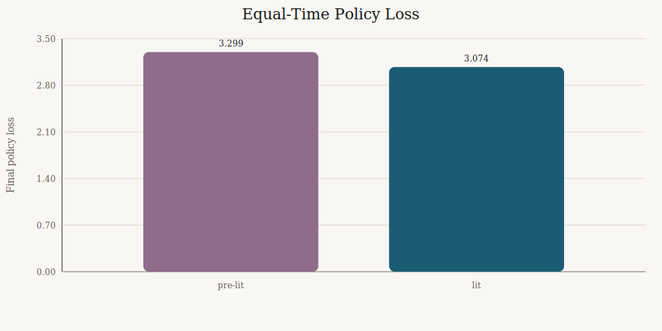
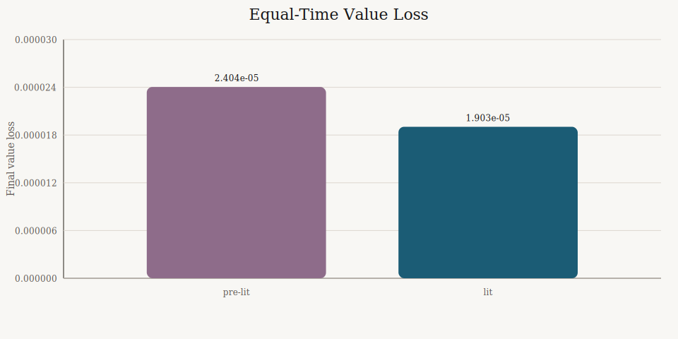
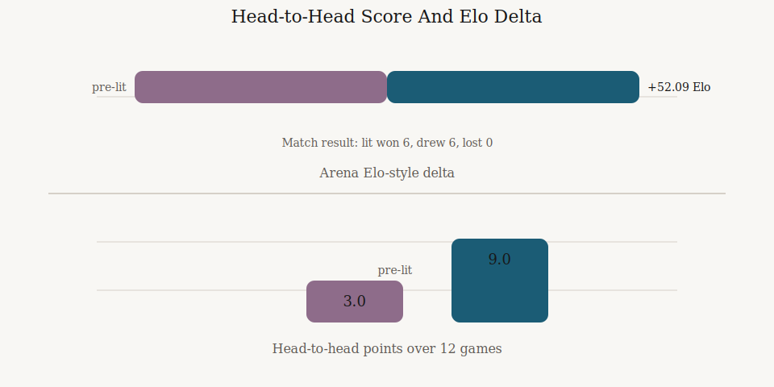

# Same-Time A/B: Literature Lane vs Pre-Literature Lane

- Generated (UTC): 2026-03-10T01:00:00Z
- Goal: compare the new literature-backed lane against the previous lane at the same time budget
- Time budget: `20` minutes each
- Shared starting checkpoint: `artifacts/alphazero_cycle_conversion_fast/cycle_001/bootstrap_model.pt`

## Setup

Control lane:
- config: `configs/experiments/fast_compare_prelit.toml`
- temperature schedule: off
- replay buffer across cycles: off

New lane:
- config: `configs/fast.toml`
- temperature schedule: `1.0` until ply `24`, then `0.2`
- replay buffer across cycles: on

Important caveat:
- the `20` minute wall clock only allowed `1` cycle in each lane
- that means this comparison mostly measures the temperature-schedule change
- replay-buffer benefits need a multi-cycle A/B to become visible

## Result

The new lane was better under the same effort budget.

- Lower policy loss
- Lower value loss
- Slightly faster wall-clock runtime
- Same fixed-gate score against baseline
- Clear direct head-to-head win over the control checkpoint

## Metrics

| Metric | Pre-lit | Lit | Delta |
|---|---:|---:|---:|
| cycles completed | 1 | 1 | 0 |
| examples | 437 | 437 | 0 |
| encoded examples | 403 | 397 | -6 |
| self-play seconds | 225.390 | 222.500 | -2.890 |
| total seconds | 230.510 | 227.377 | -3.133 |
| final policy loss | 3.299151 | 3.073948 | -0.225203 |
| final value loss | 0.00002404 | 0.00001903 | -0.00000501 |
| post-train gate points | 9.0 | 9.0 | 0.0 |
| post-train gate win rate | 0.750 | 0.750 | 0.000 |
| promotion points vs incumbent | 18.0 | 17.5 | -0.5 |
| promotion score delta | 6.0 | 5.5 | -0.5 |

Source artifacts:
- `artifacts/compare_prelit_20m/cycle_summary.json`
- `artifacts/compare_lit_20m/cycle_summary.json`

## Charts

## Head-To-Head

Direct comparison artifact:
- `artifacts/compare_lit_vs_prelit_head2head/summary.json`

Head-to-head result:
- `lit` beat `prelit` `9.0 - 3.0`
- match record: `6` wins, `6` draws, `0` losses
- win rate: `0.75`
- draw rate: `0.50`
- average plies: `118.5`
- Elo-style delta from the arena summary:
  - `lit`: `+52.09`
  - `prelit`: `-52.09`

Important interpretation:
- the fixed baseline gate did not separate the two lanes
- the direct head-to-head did
- so the better evidence here is the checkpoint-vs-checkpoint result, not the shared baseline score

## What This Means

- The literature-backed lane is already stronger at the same short time budget.
- The temperature schedule appears to help immediately.
- The replay buffer change is now implemented correctly, but this `20` minute test was too short to show its main effect.
- If we want a real loss curve instead of a single-point comparison, the next experiment should be `60` minutes vs `60` minutes from the same starting checkpoint.

## Recommended Next A/B

Run:
- `60` minutes pre-lit from the same start checkpoint
- `60` minutes lit from the same start checkpoint

Then compare:
- cycle-by-cycle policy loss
- cycle-by-cycle value loss
- number of completed cycles
- final champion head-to-head
- promotion score deltas

