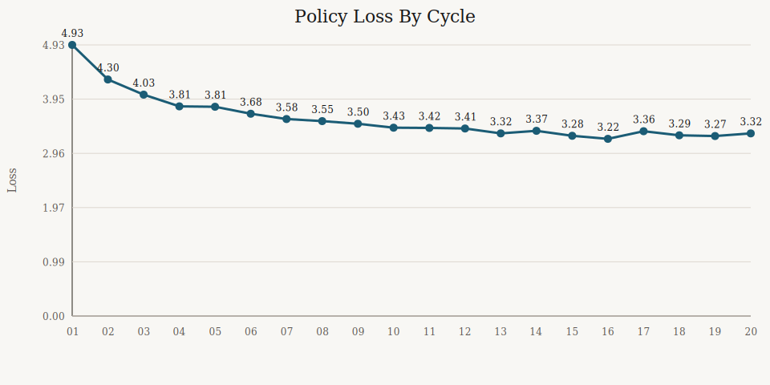
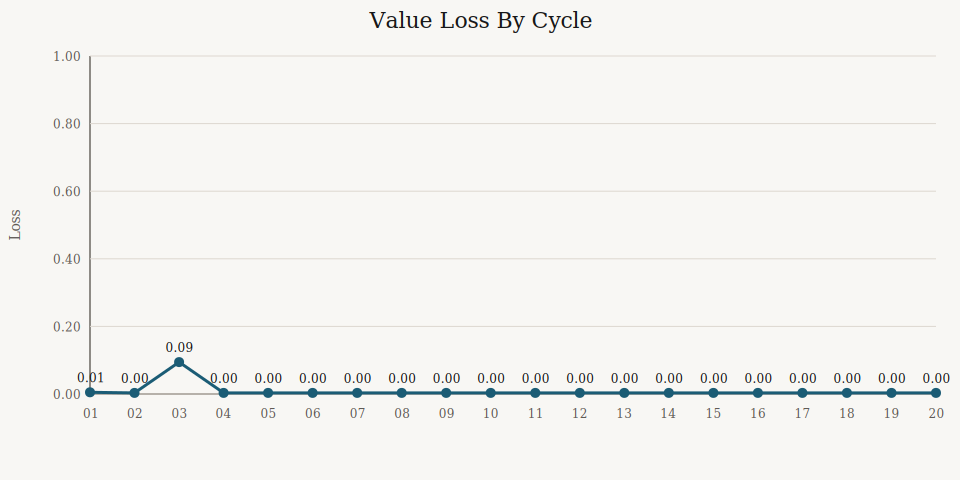
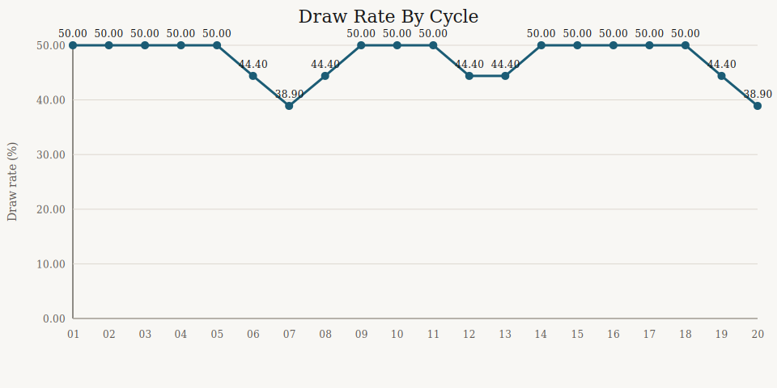

# Model Journey

- Generated (UTC): 2026-03-09
- Source run: `artifacts/alphazero_cycle_20_fast/cycle_summary.json`
- Current champion: `artifacts/alphazero_cycle_20_fast/cycle_020/bootstrap_model.pt`

## Journey At A Glance

The model did improve over the 20-cycle AlphaZero run, but the shape of that improvement matters:

- loss went down steadily enough to show the network was fitting better targets
- every cycle produced a promoted champion
- win rate did not climb smoothly every cycle
- draw rate improved some, but remained high
- the promotion match itself plateaued early, which means the evaluation lane is now too easy to separate later checkpoints

## Milestones

| Cycle | Policy Loss | Value Loss | Gate Points | Gate Win Rate | Gate Draw Rate | What Changed |
|---|---:|---:|---:|---:|---:|---|
| `001` | 4.9326 | 0.00500 | 4.5 | 0.750 | 0.500 | First usable AlphaZero checkpoint |
| `002` | 4.3040 | 0.00318 | 9.0 | 0.750 | 0.500 | First promoted head-to-head winner, beat cycle 1 by `4.5 - 1.5` |
| `007` | 3.5849 | 0.00337 | 8.5 | 0.708 | 0.389 | First cycle to hit the best observed draw rate |
| `013` | 3.3228 | 0.00329 | 9.0 | 0.750 | 0.444 | Policy loss dropped into the low `3.3` range |
| `020` | 3.3237 | 0.00322 | 8.5 | 0.708 | 0.389 | Final champion of the 20-cycle run |

## Trends

## What The Journey Means

### 1. The model is learning

Policy loss improved from `4.9326` to `3.3237`, and value loss improved from `0.00500` to `0.00322`.

That is not proof of stronger play by itself, but it is a good training-health signal.

### 2. The model is also getting stronger under the current gate

Every cycle promoted. That means each candidate checkpoint was strong enough to beat the incumbent under the current promotion rules.

### 3. The current gate is starting to saturate

From cycle `002` onward, every promotion match finished at `4.5 - 1.5`.

That means:

- improvement is still happening
- but the promotion lane is no longer telling us much about how much improvement is happening

### 4. Draws remain the core weakness

The best draw rate we saw was `0.389`. The run-average draw rate stayed around `0.4749`.

So the journey is not "model solved the game." The journey is "model became tactically stronger, but still fails to convert enough defend-first positions into wins."

## Best Companion Docs

- `docs/alphazero-20-cycle-report.md`
- `docs/board-size-ablation.md`
- `docs/next-experiment-options.md`
