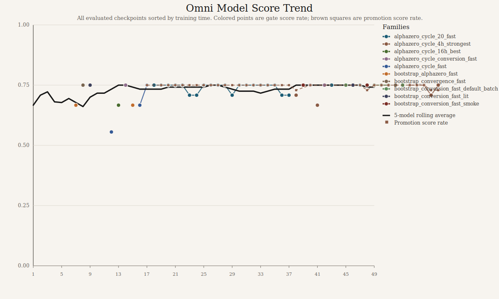
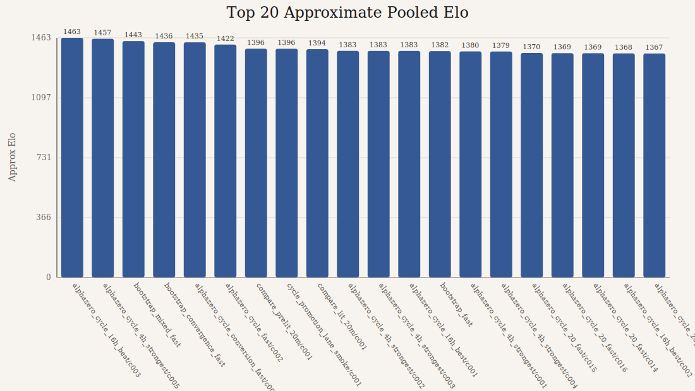

# Omni Model Report

_Generated 2026-03-10 14:12 UTC_

## Answers

- Overall normalized gate score trend is **not materially down**. The 5-model rolling average moved from `0.678` early to `0.742` late, so the trend is `up` or flat, not collapsing.
- We found `58` trained checkpoints and `49` with a comparable post-train score.
- We have enough data for an **approximate Elo** on a connected component of `57` agents using `232` deduplicated match summaries across `115` unique pairings.
- That Elo is useful for rough ranking, not as a clean canonical number, because the repo mixes different opening suites, board rules, and promotion lanes.
- If pooled Elo disagrees with a direct same-lane head-to-head, trust the direct head-to-head. The pooled number is for broad trend inspection only.

## Charts

## Best By Score

| Rank | Model | Family | Score Rate | Draw Rate | Policy Loss |
| --- | --- | --- | ---: | ---: | ---: |
| 1 | `alphazero_cycle_4h_strongest/c005` | `alphazero_cycle_4h_strongest` | `0.750` | `0.500` | `2.9745` |
| 2 | `alphazero_cycle_4h_strongest/c003` | `alphazero_cycle_4h_strongest` | `0.750` | `0.500` | `3.0970` |
| 3 | `alphazero_cycle_4h_strongest/c002` | `alphazero_cycle_4h_strongest` | `0.750` | `0.500` | `3.1641` |
| 4 | `alphazero_cycle_4h_strongest/c001` | `alphazero_cycle_4h_strongest` | `0.750` | `0.500` | `3.2588` |
| 5 | `bootstrap_local_4h_serial_smoke` | `bootstrap_local_4h_serial_smoke` | `0.750` | `0.500` | `3.6544` |
| 6 | `bootstrap_local_4h_queue_smoke` | `bootstrap_local_4h_queue_smoke` | `0.750` | `0.500` | `3.7317` |
| 7 | `alphazero_cycle_16h_best/c003` | `alphazero_cycle_16h_best` | `0.750` | `0.500` | `2.9728` |
| 8 | `alphazero_cycle_16h_best/c002` | `alphazero_cycle_16h_best` | `0.750` | `0.500` | `3.1118` |
| 9 | `alphazero_cycle_16h_best/c001` | `alphazero_cycle_16h_best` | `0.750` | `0.500` | `3.2358` |
| 10 | `compare_lit_20m/c001` | `compare_lit_20m` | `0.750` | `0.500` | `3.0739` |
| 11 | `compare_prelit_20m/c001` | `compare_prelit_20m` | `0.750` | `0.500` | `3.2992` |
| 12 | `bootstrap_conversion_fast_lit` | `bootstrap_conversion_fast_lit` | `0.750` | `0.500` | `4.8682` |

## Best By Approx Pooled Elo

| Rank | Model | Family | Elo | Elo Games | Gate Score Rate |
| --- | --- | --- | ---: | ---: | ---: |
| 1 | `alphazero_cycle_16h_best/c003` | `alphazero_cycle_16h_best` | `1462.7` | `36` | `0.750` |
| 2 | `alphazero_cycle_4h_strongest/c005` | `alphazero_cycle_4h_strongest` | `1457.0` | `36` | `0.750` |
| 3 | `bootstrap_mixed_fast` | `bootstrap_mixed_fast` | `1443.2` | `24` | `0.750` |
| 4 | `bootstrap_convergence_fast` | `bootstrap_convergence_fast` | `1435.7` | `42` | `0.750` |
| 5 | `alphazero_cycle_conversion_fast/c002` | `alphazero_cycle_conversion_fast` | `1435.5` | `12` | `0.750` |
| 6 | `alphazero_cycle_fast/c002` | `alphazero_cycle_fast` | `1421.5` | `18` | `0.750` |
| 7 | `compare_prelit_20m/c001` | `compare_prelit_20m` | `1396.4` | `48` | `0.750` |
| 8 | `cycle_promotion_lane_smoke/c001` | `cycle_promotion_lane_smoke` | `1396.2` | `36` | `0.708` |
| 9 | `compare_lit_20m/c001` | `compare_lit_20m` | `1393.6` | `84` | `0.750` |
| 10 | `alphazero_cycle_4h_strongest/c002` | `alphazero_cycle_4h_strongest` | `1383.0` | `72` | `0.750` |
| 11 | `alphazero_cycle_4h_strongest/c003` | `alphazero_cycle_4h_strongest` | `1382.9` | `72` | `0.750` |
| 12 | `alphazero_cycle_16h_best/c001` | `alphazero_cycle_16h_best` | `1382.7` | `72` | `0.750` |

## Files

- CSV: `docs/omni-model-assets/omni-models.csv`
- JSON: `docs/omni-model-assets/omni-models.json`
- Score chart: `docs/omni-model-assets/omni-score-trend.svg`
- Elo chart: `docs/omni-model-assets/omni-elo-top20.svg`