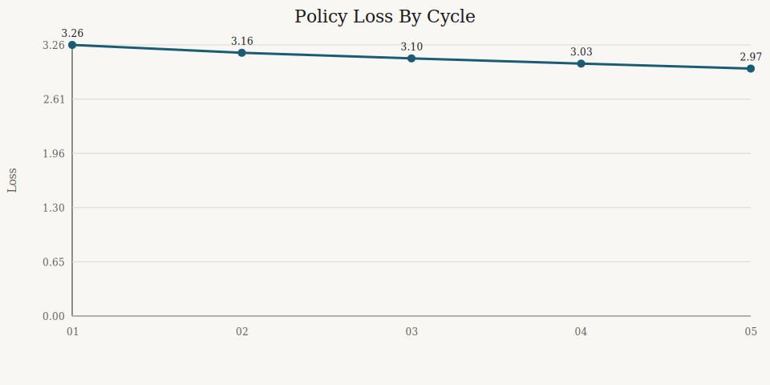
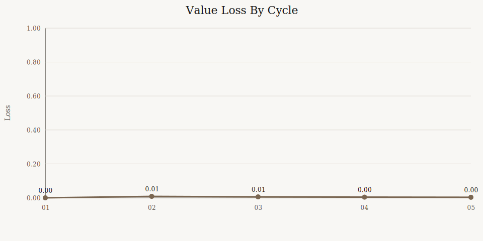
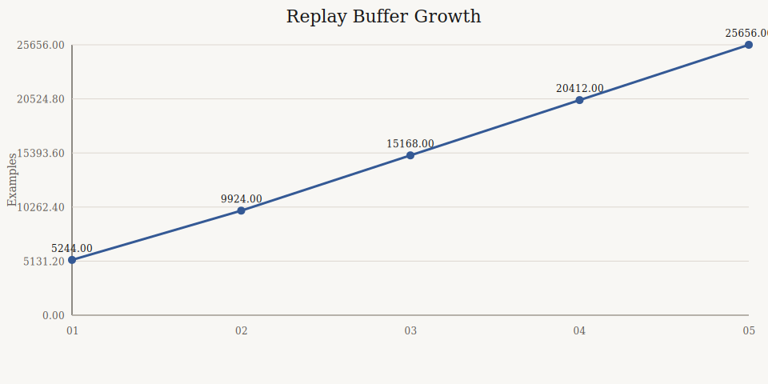
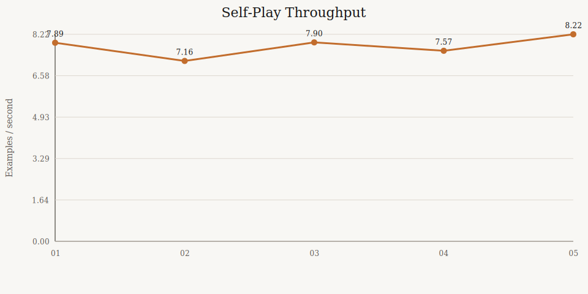
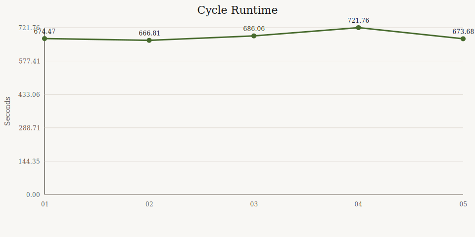
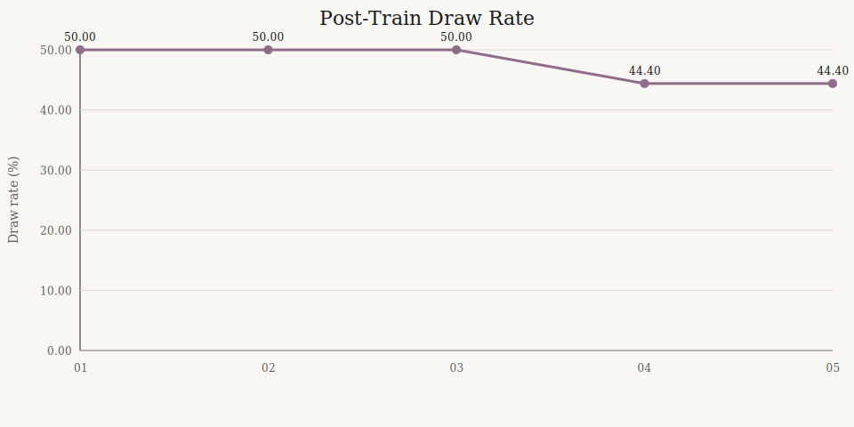
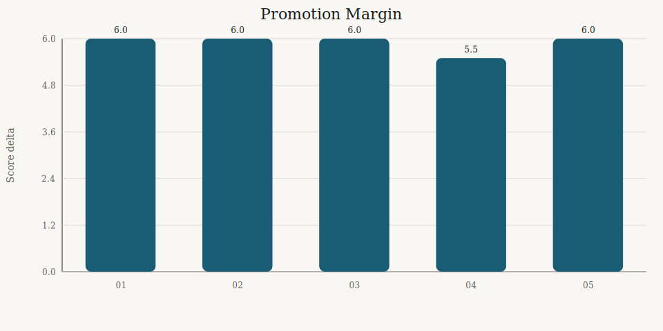
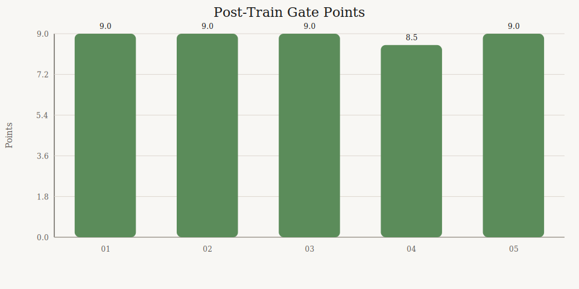

# AlphaZero Cycle Story

- Generated (UTC): 2026-03-10T12:31:19Z
- Source artifact: `artifacts\alphazero_cycle_4h_strongest\cycle_summary.json`
- Run started: `2026-03-10T08:32:15Z`
- Summary generated_at: `2026-03-10T12:31:18Z`
- Cycles completed so far: `5`
- Current best checkpoint: `artifacts\alphazero_cycle_4h_strongest\cycle_005\bootstrap_model.pt`

## The Story So Far

- The run is learning in the expected direction: policy loss moved from `3.2588` to `2.9745` over the completed cycles.
- The replay buffer is doing real work now, growing from `5244` to `25656` examples.
- The latest challenger still promoted cleanly, beating the incumbent by `17.5 - 11.5`.
- The short gate is still draw-heavy at `44.4%`, so the promotion lane remains the more informative strength test.

## Headline Metrics

| Metric | Value |
|---|---:|
| Cycles completed | 5 |
| Average cycle runtime | 684.56 s |
| First policy loss | 3.2588 |
| Latest policy loss | 2.9745 |
| First replay buffer | 5244 |
| Latest replay buffer | 25656 |
| Latest self-play throughput | 8.221 |
| Latest gate win rate | 0.750 |
| Latest gate draw rate | 0.444 |
| Latest promotion margin | 6.0 |

## Milestones

| Cycle | Policy Loss | Value Loss | Replay Buffer | Gate Points | Promotion Delta |
|---|---:|---:|---:|---:|---:|
| `001` | 3.2588 | 0.000000 | 5244 | 9.0 | 6.0 |
| `002` | 3.1641 | 0.008594 | 9924 | 9.0 | 6.0 |
| `003` | 3.0970 | 0.005606 | 15168 | 9.0 | 6.0 |
| `004` | 3.0345 | 0.004164 | 20412 | 8.5 | 5.5 |
| `005` | 2.9745 | 0.003312 | 25656 | 9.0 | 6.0 |

## Graphs

















## How To Read This

- `policy loss` tells us whether the network is fitting the MCTS visit targets better over time.
- `replay buffer` shows whether later cycles are training on a broader recent history rather than just the latest self-play batch.
- `promotion margin` is the strongest headline signal, because the short gate can saturate while challenger-vs-incumbent still separates checkpoints.
- `draw rate` staying high means the engine is still better at avoiding losses than forcing wins in the defend-first openings.

## Regenerate

```powershell
powershell -NoProfile -ExecutionPolicy Bypass -File scripts/build_cycle_story.ps1 -RepoPath "C:\Hexagonal tic tac toe" -CycleSummaryPath "artifacts\alphazero_cycle_4h_strongest\cycle_summary.json" -OutputPath "C:\Hexagonal tic tac toe\docs\overnight-4h-result.md"
```
